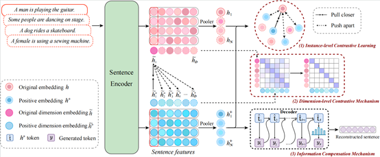
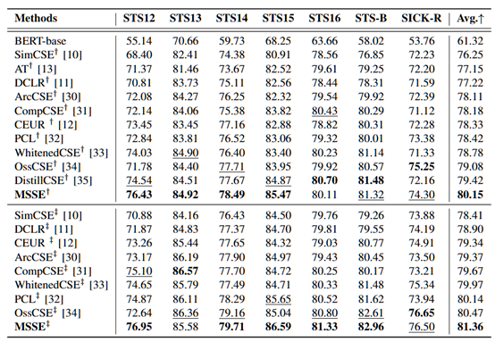

## Overview

We propose a novel sentence embedding approach, named MSSE, which is applicable to unsupervised, few-shot and supervised settings. 
MSSE enhances the model's ability to learn mutual information by utilizing the **Dimension-level Contrastice Mechanism** (DCM) and the **Information Compensation Mechanism** (ICM). The following figure is an illustration of our models.




## Getting Started

Run `pip install -r requirements.txt` to prepare the environment.

Use the script from the [SimCSE repo](https://github.com/princeton-nlp/SimCSE) to download the datasets for SentEval evaluation:

```bash
cd SentEval/data/downstream/
bash download_dataset.sh
```

## Access Our Model and Dataset from Google Drive
Both our [model checkpoint](https://drive.google.com/drive/folders/1_ioL3L7NJWUN4sQMyvdvgTAkb1YDZnx0?usp=drive_link) and [dataset](https://drive.google.com/file/d/1drl41wVn0aag8dSU2VXfOvtf2fN9dIKw/view?usp=drive_link) are available on Google Drive.


## Use Our model
``` python
import torch
from scipy.spatial.distance import cosine
from transformers import AutoModel, AutoTokenizer

# Import our models. The package will take care of downloading the models from the google drives
tokenizer = AutoTokenizer.from_pretrained("Model/MSSE")
model = AutoModel.from_pretrained("Model/MSSE")

# Tokenize input texts
texts = [
    "There's a kid on a skateboard.",
    "A kid is skateboarding.",
    "A kid is inside the house."
]
inputs = tokenizer(texts, padding=True, truncation=True, return_tensors="pt")

# Get the embeddings
with torch.no_grad():
    embeddings = model(**inputs, output_hidden_states=True, return_dict=True).pooler_output

# Calculate cosine similarities
# Cosine similarities are in [-1, 1]. Higher means more similar
cosine_sim_0_1 = 1 - cosine(embeddings[0], embeddings[1])
cosine_sim_0_2 = 1 - cosine(embeddings[0], embeddings[2])

print("Cosine similarity between \"%s\" and \"%s\" is: %.3f" % (texts[0], texts[1], cosine_sim_0_1))
print("Cosine similarity between \"%s\" and \"%s\" is: %.3f" % (texts[0], texts[2], cosine_sim_0_2))

```
## Evaluation
### Evaluation with Baselines


### Run Evaluation with SentEval
```bash
python eval_senteval.py \
    --model_name_or_path Model/MSSE-bert-base \
    --task_set sts \
    --mode test \
```

```
------ test ------
+-------+-------+-------+-------+-------+--------------+-----------------+-------+
| STS12 | STS13 | STS14 | STS15 | STS16 | STSBenchmark | SICKRelatedness |  Avg. |
+-------+-------+-------+-------+-------+--------------+-----------------+-------+
| 76.43 | 84.92 | 78.49 | 85.47 | 80.11 |   81.32      |     74.30       | 80.15 |
+-------+-------+-------+-------+-------+--------------+-----------------+-------+
```

### Run evaluation with MTEB
``` bash
python eval_mteb.py \
    --model_name_or_path results/MSSE-bert-base \
```
Evaluation results for MTEB will appear in a separate directory `mteb_results`.


## Train Your Own Models

In the following section, we describe how to train a MSSE model by using our code.

```bash
pip install torch==1.8.1+cu111 torchvision==0.9.1+cu111 torchaudio==0.8.1 -f https://download.pytorch.org/whl/torch_stable.html
```

If you instead use **CUDA** `<11` or **CPU**, install PyTorch by the following command,

```bash
pip install torch==1.8.1
```

Then run the following script to install the remaining dependencies,

```bash
pip install -r requirements.txt
```
For unsupervised setting, you can run the following command train your own models and try out different hyperparameters in it as you like
```bash
bash run_train.sh
```

For supervised setting, you can run the following command train your own models and try out different hyperparameters in it as you like.
```bash
bash run_sup_train.sh
```

## Acknowledgements

We use the [SentEval toolkit](https://github.com/facebookresearch/SentEval) and the [MTEB toolkit](https://github.com/embeddings-benchmark/mteb) for evaluations, and we adopt the modified version of SenteEal from the [SimCSE repository](https://github.com/princeton-nlp/SimCSE).